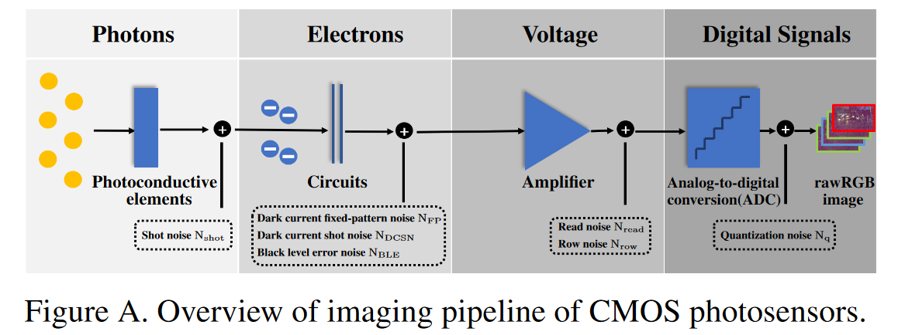

# LLD

The implementation of CVPR 2023 paper "Physics-Guided ISO-Dependent Sensor Noise Modeling for Extreme Low-Light Photography" [Paper](https://openaccess.thecvf.com/content/CVPR2023/papers/Cao_Physics-Guided_ISO-Dependent_Sensor_Noise_Modeling_for_Extreme_Low-Light_Photography_CVPR_2023_paper.pdf)" and its supplementary materials "[supplementary materials](https://openaccess.thecvf.com/content/CVPR2023/supplemental/Cao_Physics-Guided_ISO-Dependent_Sensor_CVPR_2023_supplemental.pdf)".


## Highlights

* We investigate the noise formation process in extreme low-light scenarios and propose a novel physicsguided noise model. The ISO dependence is taken into consideration in the proposed method..

 
 

* We collect a dataset for extreme low-light image denoising. The dataset contains pairwise noisy-clean images ages captured by two cameras (i.e., Sony A7S2 and Nikon D850). We also provide flat-field and bias
frames covering a wide range of ISO settings.


 


• While the learning-based nature eliminates the laborintensive parameter hand-calibration process, our proposed method can achieve superior noise modeling accuracy and boost the image denoising performance.

 


## LLD Dataset

Our proposed LLD dataset includes paired noisy (high ISO/short exposure) and clean (low ISO/long exposure) images, dark frames, and flat-field frames. All the data encompass various ISO settings and multiple brightness levels. For detailed information, please refer to the paper and the supplementary materials.You can also access the dataset through the Baidu Cloud [link](https://pan.baidu.com/s/1eLKzjOSDCR4NNLcvbyenEQ?pwd=WAXY)" and its supplementary materials " provided. If the link becomes inactive, please inform me as soon as possible.


## Citation

Our dataset required significant time and effort to capture. If you use our dataset or find our methods useful, please cite our work.

```bibtex
@InProceedings{LLD,
    author    = {Cao, Yue and Liu, Ming and Liu, Shuai and Wang, Xiaotao and Lei, Lei and Zuo, Wangmeng},
    title     = {Physics-Guided ISO-Dependent Sensor Noise Modeling for Extreme Low-Light Photography},
    booktitle = {Proceedings of the IEEE/CVF Conference on Computer Vision and Pattern Recognition (CVPR)},
    month     = {June},
    year      = {2023},
    pages     = {5744-5753}
}
```

## Contact

As some parts of the code and data are still being organized, this code repository will be continuously updated. If you have any questions or wish to discuss related topics, please feel free to email me at cscaoyue@hit.edu.cn with a brief self-introduction. Additionally, I am looking for postdoctoral research positions. If you are interested in my work, please contact me as well.
